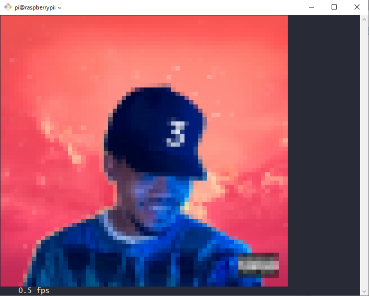

# ft-artwork

Measure hooks and Powershell script for the [Monstercat Visualizer Rainmeter skin](https://github.com/marcopixel/monstercat-visualizer) to transmit now playing album artwork to a running flaschen-taschen server. In my case, this allows displaying live album art from iTunes/Apple Music on a 64x64 rgb led matrix connected to my raspberry pi.

Files go in `C:\Users\<username>\Documents\Rainmeter\Skins\monstercat-visualizer\Song Information\Cover`

### Notes

* send-image is from the [flaschen-tachen](https://github.com/hzeller/flaschen-taschen/tree/master/client) project and must be compiled in a unix environment
* the powershell script executes it inside a WSL container
* also compatible with Spotify and other visualizer supported music players

If you have modified the skin already and just want the changes to Cover.ini, here you go!

`[Rainmeter]` \
`OnRefreshAction=[!CommandMeasure MeasureRun "Run"]`

`[MeasureRun]` \
`Measure=Plugin` \
`Plugin=RunCommand` \
`Program=PowerShell.exe` \
`Parameter=-NoProfile -ExecutionPolicy Bypass -NonInteractive -Command "& '.\UpdateArt.ps1' [MeasureCover]"` \
`OutputType=ANSI` \
`DynamicVariables=1` \
`FinishAction=[!CommandMeasure MeasureRun "Run"]`
